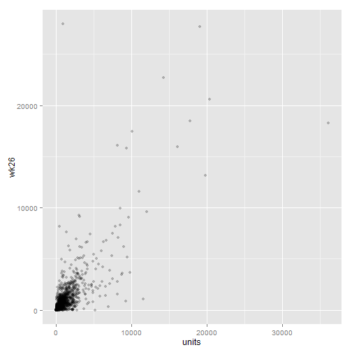
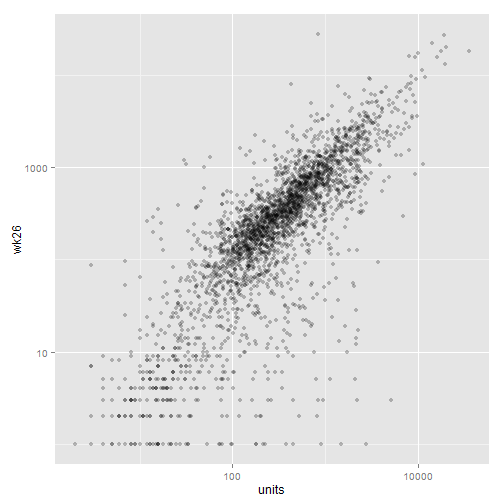
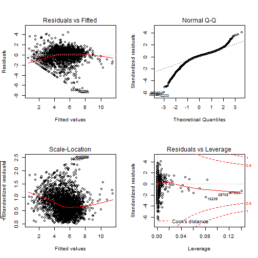
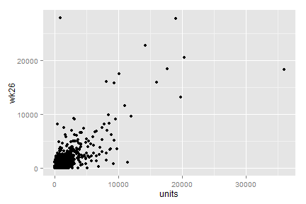
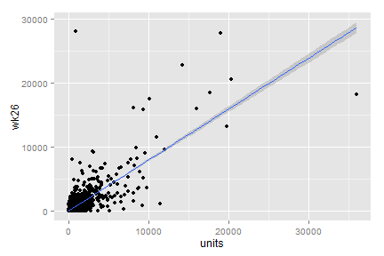
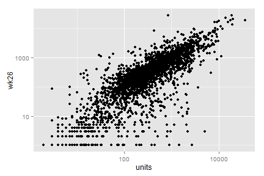
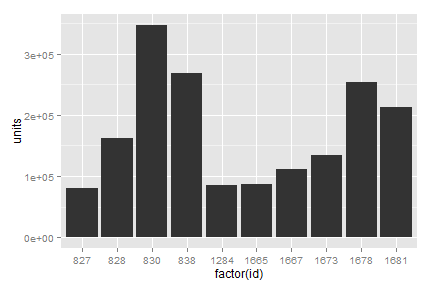
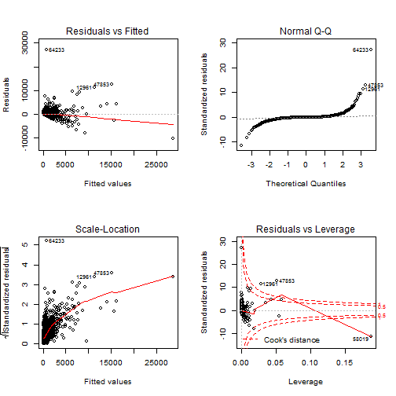

Quick introduction to R
========================================================
author: Andrie de Vries
date: 2015-06-04
width: 1380
height: 760


About your trainers
===================

Andrie de Vries

- Author of *R for Dummies*
- Set up an independent market research and statistics consultancy in 2009
- Worked as consultant for Revolution Analytics during 2012
- Joined the Revolution in 2013
- Responsible for professional services and technical training


Introduction
============
type: section


Why R?
=====

What is R?

* The fastest growing statistical programming language
* Open source implementation of S
* Over 6,000 packages on [CRAN](http://cran.r-project.org/web/packages/available_packages_by_name.html)

***

Why learn R?

* Rapid Prototyping: Turn ideas into software quickly and faithfully
* Excellent connectivity: C/C++, FORTRAN, Java
* Production quality visualization


Setting the scene
=================
type: section


Quick R Example
==================


* Based on [Kaggle competition](http://www.kaggle.com/c/hack-reduce-dunnhumby-hackathon) data
* Objective:

    - Given 13 weeks of data
    - Predict sales in week 26
    
***


Read and prepare data
=====================


```r
filename <- "data/dunnhumby hack reduce product launch challenge - training set.csv"
dat <- read.csv(filename)[, 1:7]
names(dat) <- c("id", "cat", "week", "stores", "units", "customers", "repeat")

wk13 <- dat[dat$week==13, ]
wk26 <- dat[dat$week==26, ]
df <- data.frame(wk13, wk26=wk26$units)
head(df)
```

```
    id              cat week stores units customers repeat. wk26
13   1             Dvds   13     25    43      1063      90   27
39   2        Bookstore   13     15    15      1968      11    4
65   3        Bookstore   13     19    19      1698       9    5
91   4        Bookstore   13     10    10      3150      24    3
117  6       Lightbulbs   13     33   362      1919     295   71
143  9 Candy - Packaged   13   1043  2585     11685    1570 2921
```


Plotting the data
=================

Plot week 26 sales compared to wk 13


```r
library(ggplot2)
qplot(units, wk26, data=df, alpha=I(0.25))
```

 


Plotting the data on log scale
==============================

And the same, on log scale


```r
library(ggplot2)
qplot(units, wk26, data=df, log="xy", alpha=I(0.25))
```

 


Fit a linear regression model
======================

Since the data seemed to indicate a better fit using log transform, we transform the units to log units on both sides of the equation


```r
fit <- lm(log(wk26) ~ log(units) + repeat. + customers + log(stores) + 0, 
          data=df)
summary(fit)
```

```

Call:
lm(formula = log(wk26) ~ log(units) + repeat. + customers + log(stores) + 
    0, data = df)

Residuals:
    Min      1Q  Median      3Q     Max 
-6.9816 -0.4186  0.1425  0.5784  4.4469 

Coefficients:
              Estimate Std. Error t value Pr(>|t|)    
log(units)   2.928e-01  5.191e-02   5.640 1.87e-08 ***
repeat.      2.641e-04  3.483e-05   7.584 4.55e-14 ***
customers   -3.667e-05  6.974e-06  -5.257 1.57e-07 ***
log(stores)  7.172e-01  5.652e-02  12.688  < 2e-16 ***
---
Signif. codes:  0 '***' 0.001 '**' 0.01 '*' 0.05 '.' 0.1 ' ' 1

Residual standard error: 1.093 on 2764 degrees of freedom
Multiple R-squared:  0.9621,	Adjusted R-squared:  0.962 
F-statistic: 1.753e+04 on 4 and 2764 DF,  p-value: < 2.2e-16
```


Model diagnostics
=================


```r
par(mfrow = c(2,2))
plot(fit)
```

 


The R command line
==================


The R essentials
================
type: section

Getting help
============

Access the built-in help by using `?` or with `help()`:

```r
?plot
help("plot")
```

Search documentation using `??` or `help.search()`:

```r
??plotting
help.search("plotting")
```

***

Other sources of help

* Stack Overflow
    - http://stackoverflow.com/
* R Help mailing lists 
    - http://www.r-project.org/mail.html
* Quick R 
    - http://www.statmethods.net/
* Google 
    - http://google.com
  
... to name but a few


Data objects
============

* Basic operations
* Functions
* Vectors
* Matrices
* Lists
* Data frames


Basic operations
================


```r
(2+4)-3 # addition & subtraction
```

```
[1] 3
```

```r
(3*4)/2 # multiplication & division
```

```
[1] 6
```

```r
x <- 56 # assign
x
```

```
[1] 56
```


Some commonly used functions
============================


```r
seq(0, 21, 3)
```

```
[1]  0  3  6  9 12 15 18 21
```

```r
length(4:8)
```

```
[1] 5
```


Vectors
=======


```r
11:20 # column notation
```

```
 [1] 11 12 13 14 15 16 17 18 19 20
```

```r
salary <- seq(3000, 5000, length.out = 5)
salary
```

```
[1] 3000 3500 4000 4500 5000
```


The c() word
==============

Use the function `c()` to combine elements in a vector


```r
person <- c("peter", "mary", "paul", "gary", "ricky")
person
```

```
[1] "peter" "mary"  "paul"  "gary"  "ricky"
```


Subsetting vectors /1
==================


```r
LETTERS
```

```
 [1] "A" "B" "C" "D" "E" "F" "G" "H" "I" "J" "K" "L" "M" "N" "O" "P" "Q"
[18] "R" "S" "T" "U" "V" "W" "X" "Y" "Z"
```

```r
LETTERS[3:6]
```

```
[1] "C" "D" "E" "F"
```


Subsetting vectors /2
==================


```r
x <- c(2, 5, 8, 9, 3, 7, 12, 5)
x > 5 # logical vector
```

```
[1] FALSE FALSE  TRUE  TRUE FALSE  TRUE  TRUE FALSE
```

```r
x[x > 5] # subsetting using logical vector
```

```
[1]  8  9  7 12
```

```r
x[c(2,4,7)] # subsetting using indexes
```

```
[1]  5  9 12
```


Your turn //1
=========
left: 30%


***

1. Create an object called `celsius` with the value `-40`
2. Calculate the temperature in fahrenheit.
    - Hint: fahrenheit = celsius * 9 / 5 + 32
3. Assign `[0, 5, 10, 15, 20, 25, 30]` to `celsius`. Then convert to fahrenheit.
    - Hint: Use `seq()` 
4. Use subsetting to select the 3rd and 5th element of `celcius`
    - Hint: use `[`
5. create a subset of temperatures lower than 20 degrees celcius


Using matrices
==============

Matrices can be created by folding vectors


```r
mat <- matrix(1:9, ncol = 3)
mat
```

```
     [,1] [,2] [,3]
[1,]    1    4    7
[2,]    2    5    8
[3,]    3    6    9
```


```r
mat[1:2, 2:3] # subsetting matrix
```

```
     [,1] [,2]
[1,]    4    7
[2,]    5    8
```


Working with lists
==================

Lists can contain any set of data objects


```r
list(1, matrix(1:4, ncol = 2), "New York")
```

```
[[1]]
[1] 1

[[2]]
     [,1] [,2]
[1,]    1    3
[2,]    2    4

[[3]]
[1] "New York"
```


Data frames
===========

You can represent tabular structure with data frames. Think of a data frame as similar to a table in a database, or a nicely formatted table in Excel with headings.

- All columns are the same length
- Columns can have multiple class


```r
location <- c("New York", "London", "New York", "London", "New York")
location
```

```
[1] "New York" "London"   "New York" "London"   "New York"
```

Data frames
===========


```r
employees <- data.frame(location, person, salary)
employees
```

```
  location person salary
1 New York  peter   3000
2   London   mary   3500
3 New York   paul   4000
4   London   gary   4500
5 New York  ricky   5000
```


Subsetting data frames
======================


```r
employees[,"person"] # using a char
```

```
[1] peter mary  paul  gary  ricky
Levels: gary mary paul peter ricky
```

```r
employees$person # using the dollar notation
```

```
[1] peter mary  paul  gary  ricky
Levels: gary mary paul peter ricky
```


Data frames: Selecting columns
==============================


```r
employees[, c("person", "location")] # using a char vector
```

```
  person location
1  peter New York
2   mary   London
3   paul New York
4   gary   London
5  ricky New York
```

```r
employees[, 1:2] # using a numeric vector
```

```
  location person
1 New York  peter
2   London   mary
3 New York   paul
4   London   gary
5 New York  ricky
```


Data frames: Selecting rows
===========================


```r
employees[1:3, c("person", "location")] # using a char vector
```

```
  person location
1  peter New York
2   mary   London
3   paul New York
```

```r
employees[employees$location == "New York", 1:2] # using a numeric vector
```

```
  location person
1 New York  peter
3 New York   paul
5 New York  ricky
```


Your turn //2
=========
left:30%


***

1. Create a string vector `dept` containing ("sales", "production", "sales", "sales", "production")
2. Use the function `data.frame()` to combine `dept` with the `employees` table
3. Subset the `employees` table for where location is `London`
4. Subset the `employees` table for the the `dept` is `sales`


Import and plot
===============
type: section


Correlation
===========


Importing text files
====================


General Text file function

`?read.table`

The function `read.csv()`


```r
# Loading data from CSV files
filename <- "data/dunnhumby hack reduce product launch challenge - training set.csv"
dat <- read.csv(filename)[, 1:7]
```


Aside: importing other formats
==============================

Some Useful Data Import Packages

Package   | Format
------    | ------
RODBC     | Allows connection to ODBC data sources
foreign   | SAS, SPSS, Stata
SASxport  | SAS
ROracle   | Oracle connector to R
H5R       | HDF5
RJDBC     | JDBC - Java Database Connectivity
XLConnect | Microsoft Excel

... and many more on CRAN


Inspecting the data
===================


```r
str(dat)
```

```
'data.frame':	71968 obs. of  7 variables:
 $ Product_Launch_Id                                  : int  1 1 1 1 1 1 1 1 1 1 ...
 $ Product_Category                                   : Factor w/ 198 levels "Air Care","Apples",..: 76 76 76 76 76 76 76 76 76 76 ...
 $ Weeks_Since_Launch                                 : int  1 2 3 4 5 6 7 8 9 10 ...
 $ Stores_Selling                                     : int  38 83 77 72 58 45 36 27 21 33 ...
 $ Units_that_sold_that_week                          : int  132 433 294 230 139 96 70 39 39 62 ...
 $ Distinct_Customers_Buying_At_Least_Once_Cumulative : int  88 350 537 689 780 846 895 920 948 988 ...
 $ Distinct_Customers_Buying_More_Than_Once_Cumulative: int  0 17 32 45 57 65 70 75 76 77 ...
```


Modifying the column names
==========================

Create some simpler column names that are easier to work with


```r
names(dat)
```

```
[1] "Product_Launch_Id"                                  
[2] "Product_Category"                                   
[3] "Weeks_Since_Launch"                                 
[4] "Stores_Selling"                                     
[5] "Units_that_sold_that_week"                          
[6] "Distinct_Customers_Buying_At_Least_Once_Cumulative" 
[7] "Distinct_Customers_Buying_More_Than_Once_Cumulative"
```

```r
names(dat) <- c("id", "cat", "week", "stores", "units", "customers", "repeat")
names(dat)
```

```
[1] "id"        "cat"       "week"      "stores"    "units"     "customers"
[7] "repeat"   
```


Inspecting the data
===================


```r
head(dat)
```

```
  id  cat week stores units customers repeat
1  1 Dvds    1     38   132        88      0
2  1 Dvds    2     83   433       350     17
3  1 Dvds    3     77   294       537     32
4  1 Dvds    4     72   230       689     45
5  1 Dvds    5     58   139       780     57
6  1 Dvds    6     45    96       846     65
```

```r
tail(dat)
```

```
        id                   cat week stores units customers repeat
71963 5726 Frzn Ss Premium Meals   21    376   655      6953   1480
71964 5726 Frzn Ss Premium Meals   22    342   580      7140   1545
71965 5726 Frzn Ss Premium Meals   23    338   559      7318   1613
71966 5726 Frzn Ss Premium Meals   24    339   569      7497   1684
71967 5726 Frzn Ss Premium Meals   25    323   536      7671   1733
71968 5726 Frzn Ss Premium Meals   26    326   569      7832   1790
```


Your turn //3
=========
left: 30%


***

1. Use the function `read.csv()`  to import the file `dunnhumby hack reduce product launch challenge - question set.csv`. Assign the result to  `dat`
2. Keep only the first 7 columns of your data
3. View the top 10 and bottom 7 rows of the data. (hint: `head()`, `tail()`)
4. Rename the columns so that the columns are simpler to work with


Subset and merge data
=====================


```r
# Subset week 13 and week 26 data
wk13 <- dat[dat$week == 13, ]
wk26 <- dat[dat$week == 26, ]
mdat <- data.frame(wk13, wk26=wk26$units)
head(mdat)
```

```
    id              cat week stores units customers repeat. wk26
13   1             Dvds   13     25    43      1063      90   27
39   2        Bookstore   13     15    15      1968      11    4
65   3        Bookstore   13     19    19      1698       9    5
91   4        Bookstore   13     10    10      3150      24    3
117  6       Lightbulbs   13     33   362      1919     295   71
143  9 Candy - Packaged   13   1043  2585     11685    1570 2921
```


Your turn //4
=========
left: 30%


***
1. Create `wk13` as a subset of `dat`, keeping only rows corresponding to  week 13.
2. Create a similar object `wk26`
3. Append the sales for week 26 to the data for week 13, and name the new object `mdat`


Installing R packages
=====================

A package is collection of functions that extends the functionality of R

Package   | Function
-------   | --------
XLConnect | reading from and writing to excel files
plyr      | data manipulation, particulary group-by operations
ggplot2   | data visualization

To install packages:

RGUi                          | RStudio                       | R Prompt
----                          | ----                          | --------
Package -> Install Package(s) | Tools -> Install packages ... | `install.packages()`


Loading a package
=================

Use the function `library()` to load a package into memory.


```r
library(plyr) 
library(ggplot2) 
```


Data visualization
==================

R has two different graphics paradigms:

package | aim
------- | ---
base    | The original graphics engine - pen and paper model
grid    | Uses `viewports` to define windows on a grid. Object oriented

Two very popular packages make of use of `grid`


package | aim
------- | ---
`lattice` | The original `trellis` package to create multiple small subplots.
`ggplot2` | A very popular way of building plots from components, based on the theory of *grammar of graphics*


Getting started with ggplot2
==============================

Create a scatter plot


```r
library(ggplot2) # Remember to always first load the package
qplot(units, wk26, data=mdat)
```

 


Add smoother
============


```r
qplot(units, wk26, data=mdat) + 
  stat_smooth(method = "lm")
```

 


Add log scale
=============


```r
qplot(units, wk26, data=mdat, log="xy") 
```

 


Your turn //5
=========
left: 30%


***
1. Use `qplot()` to create scatter plots and bar charts of your data
2. Create a scatter plot with a smoother


Splitting, applying and combining (SAC)
=================================
type:section


Splitting, applying and combining (SAC)
=================================
A very frequently performed task is to apply a function to chunks of data and then combine the results again.

Split

- Take an object (like a data frame) and split it into subsets on a common key (e.g. category)

Apply

- Apply a function to each subgroup, e.g. take the mean, count the elements, fit a model

Combine

- Recombine the pieces into a new dataframe (or a list)


SAC is easy with the package plyr
===================================


The function `ddply()` takes a data frame, applies a function to each subgroup and returns a data frame

```
ddply(.data, .variables, .fun = NULL, ...)
```

The meaning of the arguments:

Argument     | Meaning
------------ | -------------
`.data`      | A data frame
`.variables` | The variables (columns) to group by
`.fun`       | The function to apply to each piece
`...`        | Other arguments passed to `.fun`


Summarise by category
=====================

An example: take the data, and sum the unit sales for each category


```r
dat2 <- ddply(dat, .(cat), summarize, units = sum(units))
head(dat2)
```

```
                      cat   units
1                Air Care  335458
2                  Apples    9122
3 Backpacks/Duffels/Totes   26104
4                   Bacon  176715
5              Bag Snacks 3641693
6     Bagels&cream Cheese  189118
```


Sales of top 10 products
========================


```r
dat2 <- ddply(dat, .(id), summarize, units = sum(units))
dat2 <- dat2[order(dat2$units, decreasing = TRUE), ]
head(dat2, 10)
```

```
       id  units
1841 2870 506682
2232 3634 477924
1767 2778 405019
1143 1728 387250
1920 2987 350890
499   830 347409
2218 3618 272190
502   838 268282
1101 1678 253970
2471 4230 248496
```


Sales of top 10 categories
==========================


```r
dat2 <- ddply(dat, .(cat), summarize, units = sum(units))
dat2 <- dat2[order(dat2$units, decreasing = TRUE), ]
head(dat2, 10)
```

```
                           cat   units
5                   Bag Snacks 3641693
198                     Yogurt 2845210
51                     Cookies 2058477
53  Crackers & Misc Baked Food 1831063
154    Refrigerated Dairy Case 1734367
134               Paper Towels 1726864
28            Candy - Packaged 1400763
195                      Water 1285144
102      Frzn Ss Premium Meals 1157257
44                 Cold Cereal 1051886
```


Your turn //6
=========
left:30%


***

1. Find the top 10 products for the category "Bag snacks"


Solution
========


```r
dat2 <- ddply(dat[dat$cat=="Bag Snacks", ], .(id), summarize, units = sum(units))
dat2 <- dat2[order(dat2$units, decreasing = TRUE), ]
head(dat2)
```

```
     id  units
7   830 347409
10  838 268282
47 1678 253970
48 1681 212356
6   828 161687
42 1673 133675
```


Create bar chart
================

To create a bar chart, try:
* Use `geom="bar"`
* Turn the numeric `id` into a `factor`


```r
qplot(factor(id), units, data = head(dat2, 10), geom = "bar", stat = "identity")
```

 


Some useful geoms and stats
===========================

Some geoms to try:

geom  | meaning
----  | ------
point | scatterplot
bar   | bar chart
line  | line chart
path  | line chart


***

And some useful stats:

stat | meaning
---- | ----
identity | do not summarise
smooth   | compute smoother (e.g. `loess` or `lm`)
sum      | sum values


Your turn //7
=========
left:30%


***

1. Create a line chart of total unit sales per week
    - Hint: Use `ddply` to aggregate
    - Hint: Use `geom = "line"`
2. Add a smoother
    - Hint: Add `stat_smooth()`


Solution
========


```r
dat2 <- ddply(dat, .(week), summarise, units=sum(units))
qplot(week, units, data=dat2, geom="line") + stat_smooth()
```

 

Modeling
========
type: section


Self-description
================


Import and prepare the data
===========================


```r
filename <- "data/dunnhumby hack reduce product launch challenge - training set.csv"
dat <- read.csv(filename)[, 1:7]
names(dat) <- c("id", "cat", "week", "stores", "units", "customers", "repeat")

wk13 <- dat[dat$week==13, ]
wk26 <- dat[dat$week==26, ]
dat <- data.frame(wk13, wk26=wk26$units)
```


Linear regression
=================

The process flow

* Model
* Summary
* Diagnostics
* Prediction (fitting)


Linear regression
=================


```r
fit <- lm(wk26 ~ units, data = dat)
summary(fit)
```

```

Call:
lm(formula = wk26 ~ units, data = dat)

Residuals:
     Min       1Q   Median       3Q      Max 
-10362.6   -140.9    -69.6     67.7  27181.3 

Coefficients:
            Estimate Std. Error t value Pr(>|t|)    
(Intercept) 89.36452   20.90206   4.275 1.97e-05 ***
units        0.79104    0.01219  64.915  < 2e-16 ***
---
Signif. codes:  0 '***' 0.001 '**' 0.01 '*' 0.05 '.' 0.1 ' ' 1

Residual standard error: 995.9 on 2766 degrees of freedom
Multiple R-squared:  0.6037,	Adjusted R-squared:  0.6036 
F-statistic:  4214 on 1 and 2766 DF,  p-value: < 2.2e-16
```


What does the formula mean?
===========================

`z | x + y`

This means model `y` as a function of `x` and `z`


Symbol | Example    |     Meaning 
------ | ---------- |     -------
 ~     | z ~ x      |     "as a function of"
 +     | z ~ x + y  |     additive terms
 :     | z ~ x:y    |     interaction
 *     | z ~ a*b    |     equivalent to `z ~ x + y + x:y`
 - 1   | z ~ x - 1  |     fit a model and drop the intercept


Extract model coefficients
==========================


```r
coef(fit)
```

```
(Intercept)       units 
 89.3645202   0.7910362 
```

```r
round(c(summary(fit)$adj.r.squared, AIC(fit)), digits = 2)
```

```
[1]     0.60 46077.98
```


Diagnostic Plots
================


```r
par(mfrow = c(2,2))
plot(fit)
```

 

Predict (fitting)
=================


```r
x <- predict(fit, newdata = dat)
head(x)
```

```
        13         39         65         91        117        143 
 123.37907  101.23006  104.39421   97.27488  375.71961 2134.19297 
```


Closing thoughts:
=================

* This is a very basic tutorial!
* R has **many** different model relevant options ...
    - GLM, GAM, neural networks, Random Forest, etc.
    - Lots more on [CRAN](http://cran.r-project.org/)
    

Revolution R Enterprise
=======================

Revolution Analytics offers Enterprise grade R
- Big data, including Teradata and Hadoop
- Cross platform, including Windows, Red Hat Linux and Suse Linux
- Stability
- Scalability
- Training
- Support


 


